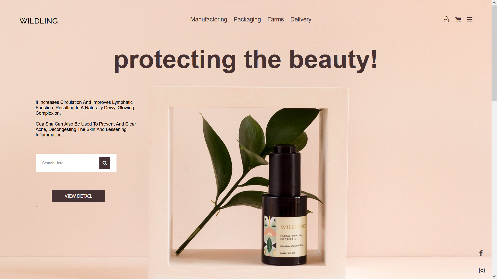

<!-- PROJECT LOGO -->
 

  

<h3 align="center">Frontend Mentorship Challenge - 04 - WILDLING</h3>

  

    Landing Page for a Beauty Company!
     
    <a href="https://github.com/cenaei"><strong>More by me »</strong></a>
     
     
    <a href="https://github.com/cenaei">Final Project [Soon]</a>
    ·
    <a href="https://github.com/cenaei/frontend-mentorship-challenge-04/issues">Report Bug</a>
    ·
    <a href="https://github.com/cenaei/frontend-mentorship-challenge-04/issues">Request Feature</a>
  

<!-- TABLE OF CONTENTS -->

  
Other Projects

  <ol>
    <li><a href="https://github.com/cenaei/frontend-mentorship-challenge-00">0 - Task Manager</a></li>
    <li><a href="https://github.com/cenaei/frontend-mentorship-challenge-01">1st - Travel with us</a></li>
    <li><a href="https://github.com/cenaei/frontend-mentorship-challenge-02">2nd - Login Form</a></li>
    <li><a href="https://github.com/cenaei/frontend-mentorship-challenge-03">3rd - Travel with us</a></li>
    <li><a href="https://github.com/cenaei/frontend-mentorship-challenge-04">4rd - WIDLING</a></li>
  </ol>

<!-- Main Page -->
## Main Page

[Main Page for All Projects](https://github.com/cenaei/frontend-mentorship-challenge/)

(<a href="#top">back to top</a>)

### This is Built With

* [HTML](https://html.spec.whatwg.org/)
* [CSS](https://www.w3.org/TR/CSS/#css)
* [SASS](https://sass-lang.com/) [Soon]
* [JS](https://www.javascript.com/) [Soon]

(<a href="#top">back to top</a>)

<!-- CONTACT -->
## Contact

Sina Sangiji - [@cenaei](https://twitter.com/cenaei) - sina.sangiji@gmail.com

Main Project Link: [https://github.com/cenaei/frontend-mentorship-challenge/](https://github.com/cenaei/frontend-mentorship-challenge/)

(<a href="#top">back to top</a>)

<!-- ACKNOWLEDGMENTS -->
## Acknowledgments

* [Build My Readme By](https://github.com/othneildrew/Best-README-Template)

(<a href="#top">back to top</a>)
